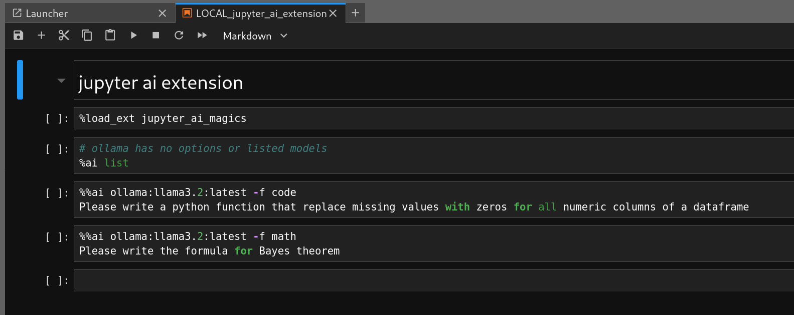

# Local JupyterLab with Ollama and Jupyter AI Extension

This setup provides a **locally accessible JupyterLab** with integrated Ollama support and the Jupyter AI extension.
The jupyter lab is using the dark-mode theme, and line numbers are enabled.

> **Note:** Rclone configuration is still incomplete here.

## References

- Minimal Jupyter Notebook base image: [jupyter/docker-stacks minimal-notebook](https://github.com/jupyter/docker-stacks/tree/main/images/minimal-notebook)
- Base Notebook Dockerfile: [base-notebook/Dockerfile](https://github.com/jupyter/docker-stacks/blob/main/images/base-notebook/Dockerfile)
- Docker Stacks Foundation Dockerfile: [docker-stacks-foundation/Dockerfile](https://github.com/jupyter/docker-stacks/blob/main/images/docker-stacks-foundation/Dockerfile)
- Why use `tini` as init process: [krallin/tini#why-tini](https://github.com/krallin/tini#why-tini)

## Screenshot

## Notes

- To create a tar archive with specific ownership:  
`tar --owner=1000 --group=100 -cf ../c.tar .bash_aliases .jupyter/ rclone.sh`
- To list the tar archive contents with numeric owner:  
`tar --numeric-owner -tvf c.tar`
- The `ollama list` shows a total of 39 GB, differing from the `du -khs /var/lib/docker/volumes/ollama` output of 27 GB, due to layer reuse in Docker.

